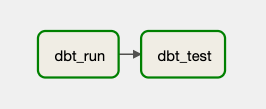
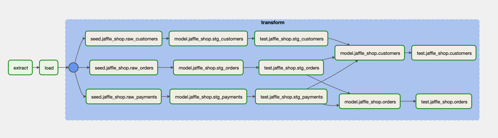

# dbt-airflow
A Python package that helps Data and Analytics engineers render dbt projects in Apache Airflow DAGs such that
models, seeds, snapshots and tests are represented by individual Airflow Task.

`dbt` is a command-line tool that enables data teams build, maintain and test data models in a scalable fashion. The 
biggest challenge though is how to embed `dbt` in modern data workflows and infrastructure. dbt CLI is indeed a powerful
tool, but if used as is, it will create silos in the way an organisation manages its data. Every contributor is able to 
run `dbt` commands from their local machine (or even a host machine), but how do you know if a model run by another 
contributor has failed, or succeeded? How can you enable shared visibility over data models, within the team? 

One way to host dbt projects and orchestrate dbt tasks is via Apache Airflow. In its simplest form, an Airflow DAG
that will build and test data models will consist of two tasks, one that executes `dbt run` command followed by an 
Airflow task that executes `dbt test`. 



But what happens when model builds or tests fail? Should we re-run the whole dbt project (that could involve hundreds of 
different models and/or tests) just to run a single model we've just fixed? This doesn't seem to be a good practice 
since re-running the whole project  will be time-consuming and expensive. 

A potential solution to this problem is to create individual Airflow tasks for every model, seed, snapshot and test
within the dbt project. If we were about to do this work manually, we would have to put huge effort that would also be 
prone to errors. Additionally, it would beat  the purpose of dbt, that among other features, it also automates model 
dependency management.

`dbt-airflow` is a package that builds a layer in-between Apache Airflow and dbt, and enables teams to automatically
render their dbt projects in a granular level such that they have full control to individual dbt resource types. Every
dbt model, seed, snapshot or test will have its own Airflow Task so that you can perform any action at a task-level. 

Here's how the popular Jaffle Shop dbt project will be rendered on Apache Airflow via `dbt-airflow`:




### Features
- Render a `dbt` project as a `TaskGroup` consisting of Airflow Tasks that correspond to dbt models, seeds, snapshots
and tests
- Every `model`, `seed` and `snapshot` resource that has at least a single test, will also have a corresponding
test task as a downstream task
- Add tasks before or after the whole dbt project
- Introduce extra tasks within the dbt project tasks and specify any downstream or upstream dependencies
- Create sub-`TaskGroup`s of dbt Airflow tasks based on your project's folder structure 

## How does it work
The library essentially builds on top of the metadata generated by `dbt-core` and are stored in 
the `target/manifest.json` file in your dbt project directory. This means that you first need to compile (or run 
any other dbt command that creates the `manifest` file) before creating your Airflow DAG. This means the `dbt-airflow` 
package expects that you have already compiled your dbt project so that an up to date manifest file can then be used
to render the individual tasks.

---

# Installation

The package is available on PyPI and can be installed through `pip`:
```bash
pip install dbt-airflow
```

`dbt` needs to connect to your target environment (database, warehouse etc.) and in order to do so, it makes use of 
different adapters, each dedicated to a different technology (such as Postgres or BigQuery). Therefore, before running
`dbt-airflow` you also need to ensure that the required adapter(s) are installed in your environment. 

For the full list of available adapters please refer to the official 
[dbt documentation](https://docs.getdbt.com/docs/available-adapters). 

---
# Usage


### Building an Airflow DAG using `dbt-airflow`

```python3
from datetime import datetime
from pathlib import Path

from airflow import DAG
from airflow.operators.python import PythonOperator
from airflow.operators.dummy import DummyOperator

from dbt_airflow.core.task_group import DbtTaskGroup
from dbt_airflow.core.task import ExtraTask


with DAG(
    dag_id='test_dag',
    start_date=datetime(2021, 1, 1),
    catchup=False,
    tags=['example'],
) as dag:

    extra_tasks = [
        ExtraTask(
            task_id='test_task',
            operator=PythonOperator,
            operator_args={
                'python_callable': lambda: print('Hello world'),
            },
            upstream_task_ids={
                'model.example_dbt_project.int_customers_per_store',
                'model.example_dbt_project.int_revenue_by_date'
            }
        ),
        ExtraTask(
            task_id='another_test_task',
            operator=PythonOperator,
            operator_args={
                'python_callable': lambda: print('Hello world 2!'),
            },
            upstream_task_ids={
                'test.example_dbt_project.int_customers_per_store',
            },
            downstream_task_ids={
                'snapshot.example_dbt_project.int_customers_per_store_snapshot',
            }
        ),
        ExtraTask(
            task_id='test_task_3',
            operator=PythonOperator,
            operator_args={
                'python_callable': lambda: print('Hello world 3!'),
            },
            downstream_task_ids={
                'snapshot.example_dbt_project.int_customers_per_store_snapshot',
            },
            upstream_task_ids={
                'model.example_dbt_project.int_revenue_by_date',
            },
        )
    ]

    t1 = DummyOperator(task_id='dummy_1')
    t2 = DummyOperator(task_id='dummy_2')

    tg = DbtTaskGroup(
        group_id='dbt-company',
        dbt_manifest_path=Path('/opt/airflow/example_dbt_project/target/manifest.json'),
        dbt_target='dev',
        dbt_project_path=Path('/opt/airflow/example_dbt_project/'),
        dbt_profile_path=Path('/opt/airflow/example_dbt_project/profiles'),
        extra_tasks=extra_tasks,
        create_sub_task_groups=True,
        operator_class='BashOperator',
    )

    t1 >> tg >> t2

```
