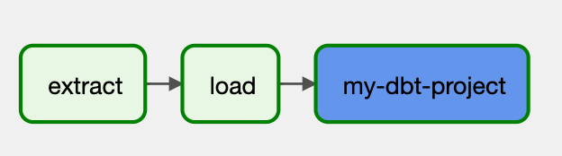
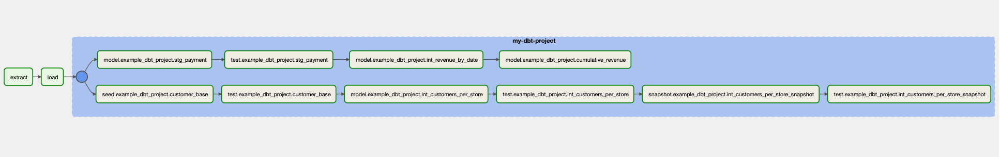

# Example DAGs: Basic
This is an example DAG that will create two (dummy) tasks namely `extract` and `load`, 
followed by a `DbtTaskGroup` that renders a dbt project that: 
- Is located in `/path/to/dbt/project/` 
- Whose compiled manifest JSON file is found under `/path/to/dbt/project/target/manifest.json`
- Uses the profile specified (in `dbt_project.yml`) in `profiles.yml` file, that is located in `/path/to/dbt/project/profiles/dir`. 
- With `dev` target (that must be present in profile definition)

The `DbtTaskGroup` has disabled `create_sub_task_groups`, meaning that all individual dbt resources will be rendered
at the same level, under the `DbtTaskGroup` Airflow Task Group. 


## Code
```python
from pathlib import Path

from airflow.decorators import dag
from airflow.operators.dummy import DummyOperator
from airflow.utils.dates import days_ago
from dbt_airflow.core.task_group import DbtTaskGroup


@dag(schedule=None, tags=['example'], start_date=days_ago(1))
def tutorial_dbt_airflow_basic():
    """
    This is an example Airflow DAG that represents a fundamental ELT pipeline where the
    transformation part is performed with `dbt-airflow`.

    The creation of sub task-groups is disabled such that all Airflow Tasks (each of which
    corresponds to a single dbt resource type), will be under the main DbtTaskGroup named
    `my-dbt-project`.
    """
    extract = DummyOperator(task_id='extract')
    load = DummyOperator(task_id='load')
    transform = DbtTaskGroup(
        group_id='my-dbt-project',
        dbt_manifest_path=Path('/path/to/dbt/project/target/manifest.json'),
        dbt_target='dev',
        dbt_project_path=Path('/path/to/dbt/project/'),
        dbt_profile_path=Path('/path/to/dbt/project/profiles/dir'),
        create_sub_task_groups=False,
    )

    extract >> load >> transform


dag = tutorial_dbt_airflow_basic()
```

## How the DAG is rendered on Airflow

This is how the DAG will initially look like on Apache Airflow:



When you click on the `my-dbt-project` TaskGroup, you will then be able to see all the dbt resources rendered as 
individual Airflow Tasks. 


